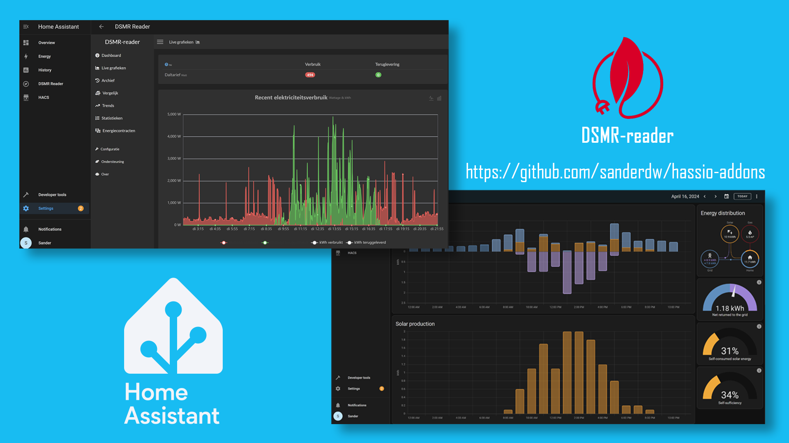
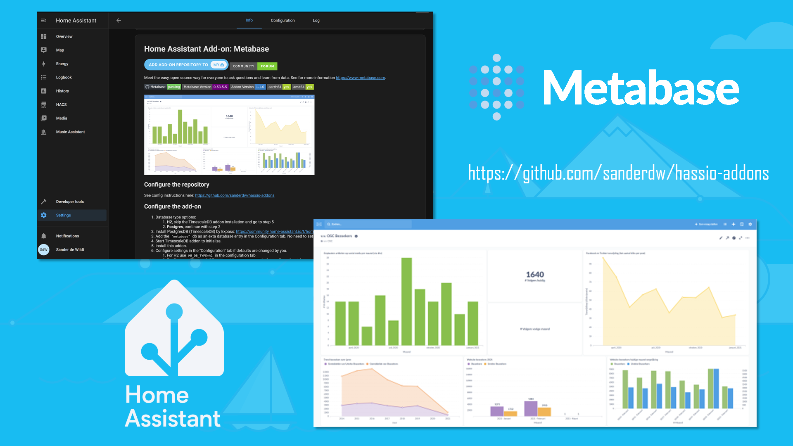

# Home Assistant Add-ons: DSMR Reader/Datalogger & Metabase

[![Community Forum][forum-shield]][forum]

## About DSMR Reader/Datalogger

Provide a tool to easily extract, store and visualize data transferred by the DSMR protocol of your smart meter.
Allow you to export your data to other systems or third parties. Currently supports MQTT for pushing data and an REST API for pulling data.
See the DSMR Reader webpage (https://dsmr-reader.readthedocs.io) for more background information.

## About Metabase
Meet the easy, open source way for everyone to ask questions and learn from data.
See the Metabase webpage (https://www.metabase.com) for more background information.

[aarch64-shield]: https://img.shields.io/badge/aarch64-yes-green.svg?style=flat-square
[amd64-shield]: https://img.shields.io/badge/amd64-yes-green.svg?style=flat-square
[armhf-shield]: https://img.shields.io/badge/armhf-yes-green.svg?style=flat-square
[armv7-shield]: https://img.shields.io/badge/armv7-yes-green.svg?style=flat-square
[i386-shield]: https://img.shields.io/badge/i386-yes-green.svg?style=flat-square
[forum-shield]: https://img.shields.io/badge/community-forum-brightgreen.svg?style=for-the-badge
[forum]: https://community.home-assistant.io/search?q=%40sanderdw%20%23home-assistant-os
## Configure the repository

1. Go to Supervisor -> Add-on store
2. Specify https://github.com/sanderdw/hassio-addons as the new repository URL
3. Install one of the addons which should appear after a refresh and follow the instructions.
