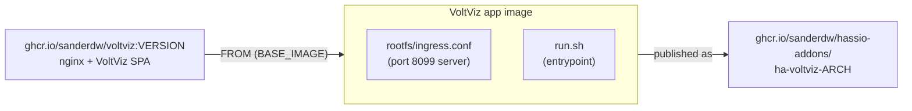
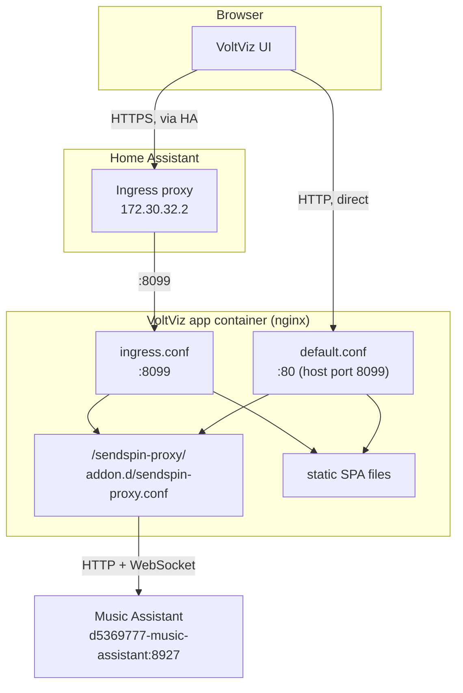
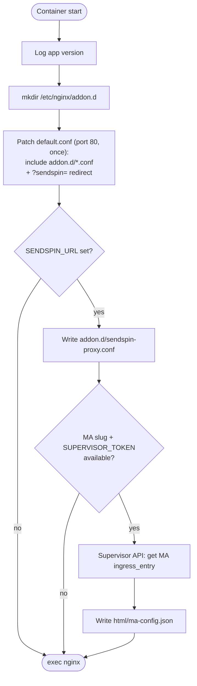
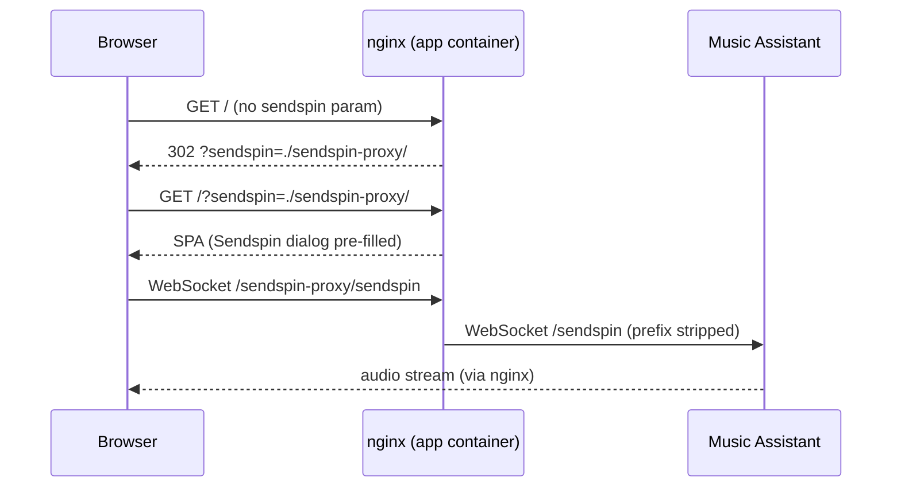

# VoltViz Home Assistant App: Architecture

This document describes how the VoltViz Home Assistant app wraps the upstream
VoltViz image, how it is reached (Ingress or direct), and how the Sendspin
proxy connects it to Music Assistant.

## Overview

The app does not build VoltViz itself. The `Dockerfile` layers Home Assistant
integration on top of the published `ghcr.io/sanderdw/voltviz` image (an nginx
image serving the VoltViz single-page app):



The base image tag is pinned in `.github/workflows/voltviz.yml` and matches
`version` in `config.json`.

## Access modes

The app can be opened through Home Assistant Ingress (recommended, works over
HTTPS) or directly on a host port.



| Mode | URL | Nginx server | Sendspin URL |
|------|-----|--------------|--------------|
| Ingress (HTTPS) | `https://ha.example.com/...` (app panel) | `ingress.conf`, port 8099 | `./sendspin-proxy/` |
| Direct (HTTP) | `http://<host>:8099/` | `default.conf`, port 80 | `./sendspin-proxy/` |

### Ingress (port 8099 inside the container)

1. `config.json` sets `"ingress": true` and `"ingress_stream": true` (WebSocket support).
2. Home Assistant connects to the container on port **8099** (the default `ingress_port`).
3. `ingress.conf` only accepts requests from `172.30.32.2` (the Ingress proxy).
4. `sub_filter` rewrites absolute `href="/` and `src="/` paths to relative
   (`./`) so the SPA works behind the Ingress path prefix.

### Direct access (port 80 inside the container, host port 8099)

- The upstream `default.conf` already serves the SPA on port 80. `config.json`
  maps it with `"ports": {"80/tcp": 8099}` and `"webui": "http://[HOST]:[PORT:80]"`
  enables the **OPEN WEB UI** button.
- `run.sh` patches `default.conf` at startup (see below) so the proxy and the
  Sendspin pre-fill also work on this port.
- The port mapping can be changed or disabled in the app's Network settings.

## File structure

```text
voltviz/
├── config.json                          # HA app configuration and schema
├── Dockerfile                           # Layers HA integration on the VoltViz image
├── run.sh                               # Entrypoint (see startup sequence)
├── CHANGELOG.md
├── README.md
├── docs/                                # This document and the development story
└── rootfs/etc/nginx/conf.d/
    └── ingress.conf                     # Nginx server for HA Ingress (port 8099)
```

## Startup sequence

`run.sh` runs on every container start:



## Sendspin proxy

### The problem

VoltViz connects to a Sendspin server (Music Assistant) over WebSocket. On an
**HTTPS** page (for example Home Assistant behind a reverse proxy) the browser
blocks WebSocket connections to a plain **HTTP** server on the local network
(mixed content), so `http://192.168.x.x:8927` cannot be used directly.

### The solution

nginx proxies Sendspin traffic server-side, so the browser only talks to the
same origin:



1. `SENDSPIN_URL` defaults to `http://d5369777-music-assistant:8927` and is read
   from `/data/options.json`.
2. `run.sh` generates `location /sendspin-proxy/` in
   `/etc/nginx/addon.d/sendspin-proxy.conf`. The trailing `/` on `proxy_pass`
   strips the prefix, and the `Upgrade`/`Connection` headers plus a 24 h
   `proxy_read_timeout` keep WebSockets alive.
3. Both nginx servers include `/etc/nginx/addon.d/*.conf`: `ingress.conf` has
   the include built in, `run.sh` injects it into `default.conf`.
4. On the first page load nginx redirects to `?sendspin=./sendspin-proxy/` when
   no `sendspin` parameter is present. The redirect is relative so the browser
   keeps the original scheme (an absolute redirect would downgrade to `http://`
   and cause mixed content). VoltViz reads the parameter and pre-fills the
   connect dialog; users can still enter any URL.

```nginx
# Generated: /etc/nginx/addon.d/sendspin-proxy.conf
location /sendspin-proxy/ {
    proxy_pass http://d5369777-music-assistant:8927/;
    proxy_http_version 1.1;
    proxy_set_header Upgrade $http_upgrade;
    proxy_set_header Connection "upgrade";
    proxy_set_header Host $host;
    proxy_set_header X-Real-IP $remote_addr;
    proxy_set_header X-Forwarded-For $proxy_add_x_forwarded_for;
    proxy_read_timeout 86400;
    proxy_send_timeout 86400;
}
```

VoltViz supports relative Sendspin URLs itself. The runtime sendspin-js patch
this app used to apply was removed in 0.15.0.

## Auto-unhide player

Music Assistant hides new players by default. When `SENDSPIN_URL` points at a
Music Assistant app, `run.sh` looks up its Ingress entry through the Supervisor
API and writes it to `/usr/share/nginx/html/ma-config.json`. The frontend reads
that file and unhides the VoltViz player through Music Assistant's Ingress
(already authenticated by Home Assistant). See
[development-story.md](development-story.md) for the background.

## Configuration reference

### `options`

| Option | Type | Default | Description |
|--------|------|---------|-------------|
| `SENDSPIN_URL` | `str?` | `http://d5369777-music-assistant:8927` | Internal URL of the Sendspin server |

### Key `config.json` settings

| Setting | Value | Purpose |
|---------|-------|---------|
| `ingress` | `true` | Enable HA Ingress |
| `ingress_stream` | `true` | WebSocket streaming through Ingress |
| `webui` | `http://[HOST]:[PORT:80]` | **OPEN WEB UI** button for direct access |
| `ports` | `{"80/tcp": 8099}` | Container port 80 on host port 8099 |
| `hassio_api` | `true` | Supervisor API access (Music Assistant ingress lookup) |
| `init` | `false` | The VoltViz image has its own CMD (nginx) |

### User setup

1. Install the app from the repository.
2. Adjust `SENDSPIN_URL` if Music Assistant runs elsewhere.
3. Start the app and click **OPEN WEB UI**.
4. Click the Sendspin button (the URL is pre-filled with `./sendspin-proxy/`) and connect.
